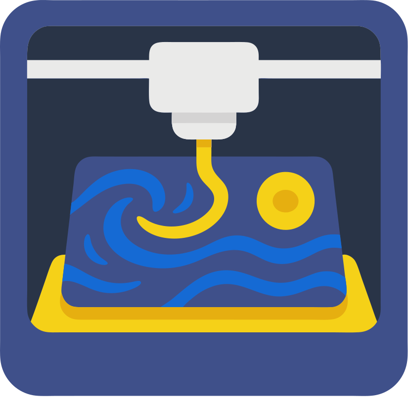
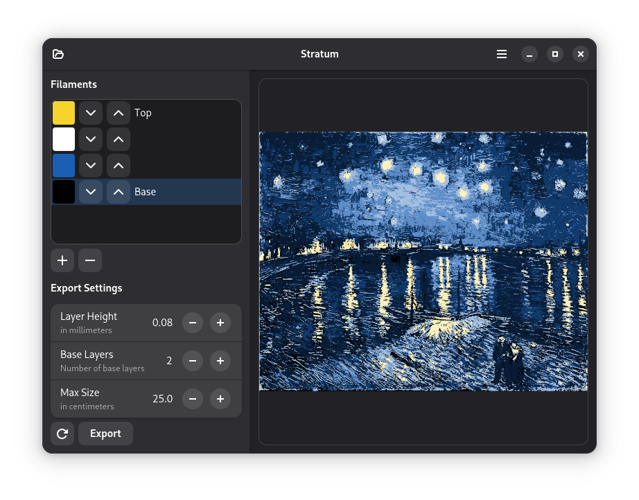

#  Stratum

Stratum is a GTK/LibAdwaita-based desktop application for converting a 2D image into layered 3D-printable meshes. It segments your image into a user-configurable number of shades (filaments), generates vector-style polygons for each shade, and exports them as a ZIP archive of STL files ready for multi-color or multi-material 3D printing.

---

## 📸 Screenshot



---

## 🚀 Features

- **Load any raster image** (PNG, JPEG, BMP)  
- **Choose filament colors**: Add, remove, reorder, and edit an arbitrary list of filament colors  
- Stratum generates color shades by layering the filaments to create more colors and smoother transitions
- **Preview**: Quickly regenerate a “mesh view” of your layered artwork  
- **Adjustable export settings**:  
  - Layer height (mm)  
  - Number of solid base layers  
  - Maximum print size (cm)  
- **Parallel processing**:  
  - Shade segmentation  
  - Polygonization  
  - Mesh (STL) generation  
- **Export** to a ZIP of STL meshes  

---

## 🛠️ Installation

### Prerequisites

- **Python 3.10+**  
- **GTK 4**  
- **LibAdwaita 1**  
- **PyGObject**  
- **Pillow** (PIL)  
- **NumPy**

On a Debian/Ubuntu system, you can install dependencies with:

```bash
sudo apt-get update
sudo apt-get install -y python3-gi python3-gi-cairo gir1.2-gtk-4.0 gir1.2-adw-1 \
                        python3-pillow python3-numpy
```

### Clone & Install

```bash
git clone https://github.com/yourusername/stratum.git
cd stratum
pip install --user .
```

This installs the `stratum` command and registers the Gtk application. You can also run it directly:

```bash
python -m stratum
```

---

## 🖥️ Usage

1. **Launch the app**  
   ```bash
   stratum
   ```
2. **Load an image** via the “Open Image” button.
3. **Configure filaments**  
   - Click “+” to add a new filament and pick its color.  
   - Reorder with the up/down arrows (top=lightest shade, base=darkest).  
   - Select a row to edit or remove a filament.  
4. **Redraw preview** to see how your filaments map to the source image.
5. **Adjust export settings** (layer height, base layers, max size).
6. **Export** a ZIP of STL meshes via the “Save Mesh” dialog.

---

## 🧩 Architecture

- **`drucken3d/window.py`**: GTK/Adw ApplicationWindow, UI callbacks, threading  
- **`lib/mask_creation.py`**:  
  - `generate_shades(colors)` — compute color thresholds  
  - `segment_to_shades(image, shades)` — map pixels to nearest shade  
- **`lib/mesh_generator.py`**:  
  - `create_layered_polygons_parallel(...)` — vectorize layers in parallel  
  - `render_polygons_to_pixbuf(...)` — draw preview to GTK `Pixbuf`  
  - `polygons_to_meshes_parallel(...)` — build STL meshes in parallel  

---

## 🤝 Contributing

1. Fork the repository  
2. Create a feature branch (`git checkout -b feature/foo`)  
3. Commit your changes (`git commit -m "Add foo"`)  
4. Push to the branch (`git push origin feature/foo`)  
5. Open a Pull Request  

Please make sure your code follows [PEP 8] and include/update tests where appropriate.

---

## 📄 License

MIT License © 2025 Seelos Dev

---

## 🙏 Acknowledgments

- Inspired by multi-filament relief art techniques  
- Built with [GTK 4](https://gtk.org), [LibAdwaita](https://gnome.pages.gitlab.gnome.org/libadwaita/), and [Pillow](https://python-pillow.org/)